# 🛡️ PolicyPARAKH: The "Iron Man" Suit for Your Contracts


> **"The AI that reads the fine print, fights the lawyer, and predicts the future—so you don't get scammed."**

[](https://policyparakh.streamlit.app/)
[]()
[]()

---

## 📖 The Story: Why We Built This?

### **Meet Rahul.**
Rahul is a 28-year-old software engineer living in Bangalore. Like many of us, he wants to protect his family. He bought a "Comprehensive" Health Insurance policy for his father (age 65), believing it covered "everything."
Three years later, his father needed an urgent knee replacement surgery. The hospital bill was **₹5,00,000**.
Rahul confidently submitted the claim, expecting a full reimbursement.

**REJECTED.**
*Reason:* "Clause 4.2: Joint replacements have a 4-year waiting period for pre-existing conditions."

Rahul lost **₹5 Lakhs** because he didn't read Page 34, Paragraph 3, Line 2 of a 100-page PDF.

### **This is not just Rahul's story.**
*   **The Tenant Trap:** Students in Mumbai lose their security deposits because they missed a tiny clause about "Mandatory Painting Charges" hidden in the lease.
*   **The Job Trap:** Fresh graduates sign offer letters without realizing they are agreeing to a **₹2 Lakh Penalty Bond** if they quit within 2 years.

**PolicyPARAKH is here to stop that.** It is an AI Agent Swarm that fights for YOU, not the corporation. It reads the fine print so you don't have to.

---

## 🧨 The Problem: "The Fine Print Epidemic"

**"Contracts are designed to be signed, not read."**

1.  **The "Non-Disclosure" Trap (Insurance):** 40% of health claims are rejected because users failed to understand a hidden clause.
    *   *Example:* If your father smokes and you didn't declare it, the insurer can cancel the **entire policy** 10 years later.
2.  **The "Security Deposit" Scam (Rent):** Landlords often hide clauses like *"Painting charges deductible"* or *"10% annual hike"* in page 15 of a lease.
3.  **The "Bond" Trap (Jobs):** Freshers sign offer letters without realizing they are agreeing to a **₹2 Lakh Penalty** if they quit within 2 years.

---

## 💡 The Solution: An "Adaptive Defense" System

We built a **Swarm of 5 Specialized Agents** + **1 Genesis Agent**, powered by a **Hybrid Brain (Gemini + Groq)**. It works on **ANY Contract** (Rent, Job, Loan, Insurance).

*   **Unified Interface:** You don't talk to 5 bots. You talk to **One Coordinator** that manages the swarm.
*   **Proactive Defense:** It doesn't just summarize; it **Simulates** (Courtroom), **Predicts** (Financials), and **Verifies** (Sentinel).
*   **Zero-Trust Security:** With the **Genesis Engine**, it can write its own code to solve new problems, but only under strict **3-Layer Guardrails**.

---

## 📚 Applied Course Concepts (The 5-Day Journey)

This project is a direct application of the **Google & Kaggle AI Agents Intensive**. We mapped every daily lesson into this architecture:

| Day | Core Concept | Implementation in PolicyPARAKH |
| :--- | :--- | :--- |
| **Day 1** | **Agent Strategy** | We utilized **Role-Based Prompting** to create distinct personas (Ruthless Lawyer, Helpful Advocate, Strict Auditor). |
| **Day 2** | **Tool Use** | We connected agents to **Tools**: `DuckDuckGo` for live laws/scams and `Plotly` for financial math. The agents autonomously decide when to call these tools. |
| **Day 3** | **Reflexion & Reasoning** | We implemented a **Critic Agent**. The Auditor generates a report, and the Critic reviews it for hallucinations or missed clauses before showing it to the user. |
| **Day 4** | **Memory & State** | We used **Session State** for the "Family Card" (Long-term context) and a **Knowledge Vault** for community-driven self-improvement. |
| **Day 5** | **Deployment** | The system is deployed on **Streamlit Cloud** with a "Round-Robin API Key Rotation" mechanism to ensure 99.9% uptime. |

---

## 🚀 What Does It Do? (The 5-Agent Swarm)

Think of PolicyPARAKH as a team of 5 elite experts sitting inside your computer, working 24/7 for your safety:

### 1. 🔍 The Auditor Agent (The Eagle Eye)
*   **Role:** The Forensic Accountant.
*   **Power:** It reads every single word of your PDF in seconds using **Gemini 2.5 Flash**.
*   **Mission:** It finds the "Red Flags" specific to your document type.
    *   *Insurance:* Finds "Room Rent Capping", "Co-Pay", "Disease Sub-limits".
    *   *Rent:* Finds "Lock-in Period", "Hidden Maintenance Charges".
    *   *Job:* Finds "Notice Period Buyout", "Non-Compete Clauses".

### 2. 🕵️ The Sentinel Agent (The Detective)
*   **Role:** The Private Investigator.
*   **Power:** It bypasses the document and goes straight to the internet.
*   **Mission:** "Trust, but Verify." It searches Reddit, Twitter, and Consumer Forums for *recent* scams or complaints about the company.
    *   *Example:* "Star Health data leak 2024" or "Landlord disputes in Indiranagar".

### 3. ⚖️ The Lawyer Agent (The Fighter)
*   **Role:** The Virtual Litigator.
*   **Power:** It simulates a **Courtroom Drama** using **Groq (Llama 3)** for high-speed dialogue.
*   **Mission:** It argues *against* the company to see if your contract holds up in court.
    *   **Judge Dredd:** Presides over the case.
    *   **Mr. Wolf (Prosecution):** Ruthless company lawyer citing clauses.
    *   **Ms. Hope (Defense):** Your advocate finding loopholes.

### 4. 📉 The Architect Agent (The Time Traveler)
*   **Role:** The Financial Futurist.
*   **Power:** It uses **Plotly** to visualize the future.
*   **Mission:** It calculates the "Real Value" of your money.
    *   *Example:* "This ₹5 Lakh cover will only be worth ₹2.5 Lakhs in 10 years due to 7% medical inflation. You need to upgrade."

### 5. 🧬 The Genesis Agent (The Engineer)
*   **Role:** The Tool Maker.
*   **Power:** It can write its own Python code.
*   **Mission:** If you ask a question the system doesn't know (e.g., "Is this hospital near me?"), it *writes a temporary script* to find the answer.
    *   **BYOK (Bring Your Own Key):** If it needs a Weather API key, it asks you for it, learns the skill, and executes it.

---

## 🎮 How to Use It? (Step-by-Step)

**Step 1: Upload Your Document** 📄
Drag and drop your **Insurance Policy**, **Rent Agreement**, or **Job Offer Letter**.

**Step 2: Watch the Magic** ✨
The system automatically detects the document type:
*   *Is it a Rent Agreement?* -> The **Tenant Guardian** wakes up.
*   *Is it a Job Offer?* -> The **Career Shield** wakes up.

**Step 3: Get the Report** 📊
You get a simple **Risk Score (0-100)**.
*   *0-30:* Safe.
*   *70-100:* **DANGER!** Do not sign.

**Step 4: Fight in Court** ⚖️
Go to the "Virtual Courtroom" in the sidebar.
*   **Scenario:** "I need to claim for a heart attack."
*   **Action:** Watch **Judge Dredd** and two AI Lawyers argue your case live!

---

## 🌟 Key Features ("God Mode")

### 🔹 1. The Family Card (Contextual Memory)
Instead of generic advice, you save a **Family Profile** once. The Agent "remembers" this via **LangChain Memory**.
*   **User Input:** *"Save this: Mom (65, Joint Pain), Dad (Smoker), Self (25, Asthmatic)."*
*   **Agent Action:** When you upload a policy, it cross-references YOUR family:
    *   *"⚠️ **Alert for Mom:** Clause 4.1 excludes Joint Replacement for 4 years. Do not buy."*

### 🔹 2. Cinematic Courtroom (Judge, Jury & Witnesses) 🎬
We gamified the legal process into a **Real-Time Drama**.
*   **The Cast:**
    *   **Judge Dredd (AI):** Presides over the case.
    *   **Mr. Wolf (Prosecution):** Ruthless company lawyer.
    *   **Ms. Hope (Defense):** Your advocate.
    *   **The Witnesses:** The **Architect Agent** (Time Traveler) and **Sentinel Agent** (Detective) are called to the stand to provide evidence.
*   **The Experience:** The script plays out line-by-line with cinematic delays, creating high-stakes tension.

### 🔹 3. Deep Memory (The Vault) 🧠
The system never forgets.
*   **Case History:** Every verdict, every argument, and every risk report is stored in the **Knowledge Vault**.
*   **Evolution:** If you win a case against "Star Health" today, the system remembers that argument for your next uploaded policy.

### 🔹 4. "Bring Your Own Key" (BYOK) Protocol 🔐
We respect user privacy and speed.
*   **Freedom:** Users can plug in their own **Groq API Key** in the sidebar to unlock maximum speed for the Courtroom debate.

### � 5. The "Self-Evolving" Genesis Engine (BYOK + Vote) 🗳️
The system is not static; it evolves based on user needs.
*   **Scenario:** User asks for "Live Flood Risk" (requires Weather API).
*   **The Block:** System realizes it lacks the API key.
*   **The Offer:** *"I lack the Weather Key. Enter YOUR key for this session, or Vote for me to add it."*
*   **The Feedback Loop:** If 5 users provide a key, the Admin gets a notification to buy a permanent key. **The system grows with the community.**

---

## 🏗️ System Architecture: The "Double-Vision" Design

To understand PolicyPARAKH, you need to see it at two levels: The **Macro Flow** (User Journey) and the **Micro Swarm** (Agent Interaction).

### 🔭 View 1: The Macro Flow (User Journey)
This is what the user experiences. It's a simple, linear path from Upload to Defense.

```mermaid
graph LR
    %% Styles
    classDef user fill:#000,stroke:#fff,color:#fff
    classDef bot fill:#2C2C2E,stroke:#4F8BF9,color:#fff
    classDef action fill:#1E1F20,stroke:#00FF41,color:#fff

    User(👤 User) --> |Upload PDF| Router[🚦 Universal Router]:::bot
    Router --> |Classify| Swarm[🐝 Agent Swarm]:::action
    Swarm --> |Analyze| Report[📄 Risk Report]:::bot
    Report --> |Simulate| Court[⚖️ Virtual Courtroom]:::action
    Court --> |Verdict| User
```



---

### 🔬 View 2: The Neural Swarm (Under the Hood)
This is where the magic happens. The **5-Layer Iron Dome** architecture ensures that every document is treated by a specialist, not a generalist.

```mermaid
graph TD
    %% Styles
    classDef router fill:#FF4B4B,stroke:#fff,color:#fff
    classDef specialist fill:#00CC66,stroke:#fff,color:#fff
    classDef experience fill:#2C2C2E,stroke:#4F8BF9,color:#fff
    classDef safety fill:#450a0a,stroke:#EF4444,color:#fff

    Input(📄 User Upload) --> Router{🚦 Layer 1: Universal Router}:::router

    subgraph "Layer 2: The Specialist Swarm"
        Router -- "Insurance" --> Auditor[🔍 Auditor Agent]:::specialist
        Router -- "Rent" --> Tenant[🏠 Tenant Guardian]:::specialist
        Router -- "Job" --> Career[💼 Career Shield]:::specialist
    end

    subgraph "Layer 3: The Experience Swarm"
        Auditor & Tenant & Career --> Architect["Architect Agent (Plotly)"]:::experience
        Auditor & Tenant & Career --> Lawyer["⚖️ Lawyer Persona (Llama 3)"]:::experience
        Auditor & Tenant & Career --> Scout["🔭 Market Scout (Search)"]:::experience
    end

    subgraph "Layer 4: The Genesis Engine"
        Router -- "Unknown Task?" --> Genesis[🧬 Genesis Agent]:::experience
        Genesis -- "Draft Code" --> Critic{🧐 Code Critic}:::safety
        Critic -- "Approved" --> Gate{🔒 Permission Gate}:::safety
        Gate -- "Allowed" --> Tool[🛠️ New Python Tool]:::specialist
    end

    subgraph "Layer 5: The Iron Dome"
        Architect & Lawyer & Scout & Tool --> Sentinel[🕵️ Sentinel Agent]:::safety
        Sentinel --> Output(⚡ Final Response)
    end
```


### 🧠 Agent Roster (Who does what?)

| Agent | Model | Role |
| :--- | :--- | :--- |
| **Auditor Agent** | Gemini 2.5 Flash | **Insurance Specialist.** Finds Co-pay, Capping. |
| **Tenant Guardian** | Gemini 2.5 Flash | **Real Estate Specialist.** Finds Lock-in, Eviction traps. |
| **Career Shield** | Gemini 2.5 Flash | **Employment Specialist.** Finds Bonds, Non-Compete. |
| **Genesis Agent** | Gemini 2.5 Pro | **The Engineer.** Writes Python code for unknown tasks. |
| **The Lawyer** | Llama 3 (Groq) | **The Simulator.** Argues against you to test your case. |
| **The Sentinel** | Gemini 2.5 Flash | **The Safety Net.** Checks for hallucinations & scams. |

---

## 👨‍💻 Behind the Scenes (Code Logic)

**The "Swarm" Coordinator (`app.py`)**
The main app acts as the conductor. It doesn't do the work; it delegates.
```python
# When a file is uploaded...
if uploaded_file:
    # 1. Wake up the Auditor
    auditor = AuditorAgent()
    report = auditor.audit(text)
    
    # 2. Wake up the Sentinel
    sentinel = SentinelAgent()
    reputation = sentinel.check(company_name)
    
    # 3. Display results in Glass UI
    render_dashboard(report, reputation)
```

**The "Persona" Injection (`agents/lawyer.py`)**
We don't just ask for a summary; we inject a personality.
```python
# We inject "Persona" directly into the system prompt
prompt = """
You are Mr. Wolf, a ruthless company lawyer. 
Your goal: Find ONE clause to reject this claim.
Tone: Sarcastic, professional, cold.
"""
```

---

## 🌟 Project Impact

**PolicyPARAKH** addresses a critical gap in the fintech ecosystem: **Information Asymmetry.**

While corporations utilize advanced data analytics and legal teams to minimize payouts, consumers have historically relied on intuition. By deploying an **Autonomous Swarm Architecture**, this project empowers the individual with an institutional-grade defense system.

It transforms a static document into a **Dynamic Risk Assessment**, ensuring that financial products serve the user, not just the issuer. This is the future of **Consumer Protection AI**.

---

## 🛠️ Technical Stack

*   **LLM Backbone:**
    *   **Gemini 2.5 Flash:** Speed & Context (Auditor, Scout).
    *   **Gemini 2.5 Pro:** Reasoning & Code Generation (Genesis).
    *   **Groq (Llama 3 70B):** High-Speed Inference (Courtroom Simulator).
*   **Orchestration:** **LangChain** (for Chains, Memory, and dynamic Tool construction).
*   **Frontend:** Streamlit (UI) with **Frosted Glass CSS**.
*   **Tools:** `DuckDuckGoSearchRun`, `Plotly`, `PythonREPL`.
*   **Security:** Round-Robin API Key Rotation & **Owner-Only Execution Gates**.

---

## 👨‍💻 How to Run Locally

1.  **Clone the Repo:**
    ```bash
    git clone https://github.com/yourusername/policyparakh.git
    cd policyparakh
    ```

2.  **Install Dependencies:**
    ```bash
    pip install -r requirements.txt
    ```

3.  **Set up Secrets:**
    Create `.streamlit/secrets.toml` and add your API keys:
    ```toml
    GOOGLE_API_KEY = "your_key"
    GROQ_API_KEY = "your_key"
    ```

4.  **Run the App:**
    ```bash
    streamlit run app.py
    ```

---
*Built with ❤️ for the Kaggle AI Agents Intensive 2025.*

---

## 📄 License

This project is licensed under the GNU Affero General Public License v3.0 (AGPL v3) - see the [LICENSE](LICENSE) file for details.

Copyright (c) 2025 Deepak Kushwah. All rights reserved.

