# 🛡️ PolicyPARAKH: The "Iron Man" Suit for Your Contracts

> **"The AI that reads the fine print, fights the lawyer, and predicts the future—so you don't get scammed."**

[](https://policyparakh.vercel.app/)
[]()
[]()

---

## 📖 The Story: Why We Built This?

### **Meet Rahul.**
Rahul is a 28-year-old software engineer living in Bangalore. Like many of us, he wants to protect his family. He bought a "Comprehensive" Health Insurance policy for his father (age 65), believing it covered "everything."
Three years later, his father needed an urgent knee replacement surgery. The hospital bill was **₹5,00,000**.
Rahul confidently submitted the claim, expecting a full reimbursement.

**REJECTED.**
*Reason:* "Clause 4.2: Joint replacements have a 4-year waiting period for pre-existing conditions."

Rahul lost **₹5 Lakhs** because he didn't read Page 34, Paragraph 3, Line 2 of a 100-page PDF.

### **This is not just Rahul's story.**
*   **The Tenant Trap:** Students in Mumbai lose their security deposits because they missed a tiny clause about "Mandatory Painting Charges" hidden in the lease.
*   **The Job Trap:** Fresh graduates sign offer letters without realizing they are agreeing to a **₹2 Lakh Penalty Bond** if they quit within 2 years.

**PolicyPARAKH is here to stop that.** It is an AI Agent Swarm that fights for YOU, not the corporation. It reads the fine print so you don't have to.

---

## 🧨 The Problem: "The Fine Print Epidemic"

**"Contracts are designed to be signed, not read."**

1.  **The "Non-Disclosure" Trap (Insurance):** 40% of health claims are rejected because users failed to understand a hidden clause.
2.  **The "Security Deposit" Scam (Rent):** Landlords often hide clauses like *"Painting charges deductible"* or *"10% annual hike"* in page 15 of a lease.
3.  **The "Bond" Trap (Jobs):** Freshers sign offer letters without realizing they are agreeing to a **₹2 Lakh Penalty** if they quit within 2 years.

---

## 💡 The Solution: An "Adaptive Defense" System

We built a **Swarm of 5 Specialized Agents** + **1 Genesis Agent**, powered by a **Hybrid Brain (Gemini + Groq)**. It works on **ANY Contract** (Rent, Job, Loan, Insurance).

*   **Unified Interface:** You don't talk to 5 bots. You talk to **One Coordinator** that manages the swarm.
*   **Proactive Defense:** It doesn't just summarize; it **Simulates** (Courtroom), **Predicts** (Financials), and **Verifies** (Sentinel).
*   **Zero-Trust Security:** With the **Genesis Engine**, it can write its own code to solve new problems, but only under strict **3-Layer Guardrails**.

---

## 📚 Applied Course Concepts (The 5-Day Journey)

This project is a direct application of the **Google & Kaggle AI Agents Intensive**. We mapped every daily lesson into this architecture:

| Day | Core Concept | Implementation in PolicyPARAKH |
| :--- | :--- | :--- |
| **Day 1** | **Agent Strategy** | We utilized **Role-Based Prompting** to create distinct personas (Ruthless Lawyer, Helpful Advocate, Strict Auditor). |
| **Day 2** | **Tool Use** | We connected agents to **Tools**: `DuckDuckGo` for live laws/scams and `Plotly` for financial math. The agents autonomously decide when to call these tools. |
| **Day 3** | **Reflexion & Reasoning** | We implemented a **Critic Agent**. The Auditor generates a report, and the Critic reviews it for hallucinations or missed clauses before showing it to the user. |
| **Day 4** | **Memory & State** | We used **Session State** for the "Family Card" (Long-term context) and a **Knowledge Vault** for community-driven self-improvement. |
| **Day 5** | **Deployment** | We evolved from a script to a **Full-Stack App** (FastAPI + Next.js), implementing "God Mode" controls and production-grade architecture. |

---

## 🏗️ System Architecture: The "Double-Vision" Design

We utilize a **Modern Decoupled Architecture** (FastAPI + Next.js) to ensure scalability, speed, and a premium user experience.

```mermaid
graph TD
    %% Styles
    classDef user fill:#000,stroke:#fff,color:#fff,stroke-width:2px
    classDef frontend fill:#1a237e,stroke:#fff,color:#fff,stroke-width:2px
    classDef backend fill:#b71c1c,stroke:#fff,color:#fff,stroke-width:2px
    classDef agent fill:#2C2C2E,stroke:#4F8BF9,color:#fff,stroke-width:2px
    classDef external fill:#1E1F20,stroke:#00FF41,color:#fff,stroke-width:2px
    classDef decision fill:#FFD700,stroke:#000,color:#000,stroke-width:2px,shape:diamond

    subgraph "User Interaction Layer"
        User("👤 User") --> |"Uploads Policy PDF"| UI["🖥️ Next.js Frontend"]:::frontend
        UI --> |"POST /audit"| API["🔥 FastAPI Backend"]:::backend
    end

    subgraph "The Agent Swarm (ADK Framework)"
        API --> Router{"🧠 Intent Router"}:::decision
        
        %% Path 1: The Auditor
        Router --> |"Audit Request"| Auditor["🔍 Auditor Agent"]:::agent
        Auditor --> |"Step 1: Ingestion"| PDF["📄 PDF Loader"]:::agent
        PDF --> |"Raw Text"| Splitter["✂️ Text Splitter"]:::agent
        Splitter --> |"Chunks"| VectorDB[("🗄️ Vector Store")]:::agent
        VectorDB --> |"Retrieval"| Audit_LLM["⚡ Gemini 2.5 Flash"]:::external
        Audit_LLM --> |"Extracts Clauses"| Risk_Engine{"⚠️ Risk Analyzer"}:::decision
        Risk_Engine --> |"High Risk"| Flag["🚩 Red Flag"]:::agent
        Risk_Engine --> |"Safe"| Pass["✅ Green Check"]:::agent
        
        %% Path 2: The Courtroom
        Router --> |"Dispute Simulation"| Court["⚖️ Courtroom Agent"]:::agent
        Court --> |"Case Context"| Judge["👨‍⚖️ Judge (Gemini Pro)"]:::external
        Judge --> |"Starts Session"| Lawyer_A["🐺 Prosecution (Groq)"]:::external
        Judge --> |"Starts Session"| Lawyer_B["🛡️ Defense (Groq)"]:::external
        Lawyer_A <--> |"Debate Loop"| Lawyer_B
        Lawyer_A & Lawyer_B --> |"Arguments"| Judge
        Judge --> |"Final Verdict"| Verdict["📜 Judgment"]:::agent

        %% Path 3: The Sentinel
        Router --> |"Background Check"| Sentinel["🕵️ Sentinel Agent"]:::agent
        Sentinel --> |"Query"| Search["🌐 DuckDuckGo"]:::external
        Search --> |"Results"| Sentiment{"❤️ Sentiment Analysis"}:::decision
        Sentiment --> |"Negative"| Scam_Alert["🚨 Scam Alert"]:::agent
    end

    subgraph "Output Layer"
        Flag & Pass & Verdict & Scam_Alert --> |"JSON Response"| API
        API --> |"Real-time Stream"| UI
        UI --> |"Visual Report"| User
    end
```



---

## 🚀 What Does It Do? (The 5-Agent Swarm)

Think of PolicyPARAKH as a team of 5 elite experts sitting inside your computer, working 24/7 for your safety:

### 1. 🔍 The Auditor Agent (The Eagle Eye)
*   **Role:** The Forensic Accountant.
*   **Power:** It reads every single word of your PDF in seconds using **Gemini 2.5 Flash**.
*   **Mission:** It finds the "Red Flags" specific to your document type.

### 2. 🕵️ The Sentinel Agent (The Detective)
*   **Role:** The Private Investigator.
*   **Power:** It bypasses the document and goes straight to the internet.
*   **Mission:** "Trust, but Verify." It searches Reddit, Twitter, and Consumer Forums for *recent* scams or complaints about the company.

### 3. ⚖️ The Lawyer Agent (The Fighter)
*   **Role:** The Virtual Litigator.
*   **Power:** It simulates a **Courtroom Drama** using **Groq (Llama 3)** for high-speed dialogue.
*   **Mission:** It argues *against* the company to see if your contract holds up in court.

### 4. 📉 The Architect Agent (The Time Traveler)
*   **Role:** The Financial Futurist.
*   **Power:** It uses **Plotly** to visualize the future.
*   **Mission:** It calculates the "Real Value" of your money.

### 5. 🧬 The Genesis Agent (The Engineer)
*   **Role:** The Tool Maker.
*   **Power:** It can write its own Python code.
*   **Mission:** If you ask a question the system doesn't know, it *writes a temporary script* to find the answer.

---

## 🌟 Key Features ("God Mode")

### 🔹 1. Gemini UI Clone (Premium Experience)
We overhauled the entire interface to match the sleek, dark-themed aesthetic of Google's Gemini.
*   **Sidebar Gems:** Quick access to specific agents (Courtroom, Medical, Family).
*   **Integrated Tools:** File uploads and report generation are neatly tucked into the chat interface.

### 🔹 2. Cinematic Courtroom (Judge, Jury & Witnesses) 🎬
We gamified the legal process into a **Real-Time Drama**.
*   **The Cast:**
    *   **Judge Dredd (AI):** Presides over the case.
    *   **Mr. Wolf (Prosecution):** Ruthless company lawyer.
    *   **Ms. Hope (Defense):** Your advocate.
*   **The Experience:** The script plays out line-by-line with cinematic delays, creating high-stakes tension.

### 🔹 3. "God Mode" Admin Panel 🔐
A hidden dashboard for developers and power users.
*   **Live Stats:** Monitor active agents and risk zones.
*   **Manual Triggers:** Force-start specific agents (e.g., "Summon Courtroom").
*   **Request Management:** Approve or deny agent actions manually.

---

## 🛠️ Technical Stack

*   **Frontend:** Next.js 14 (React), Tailwind CSS, Material UI (MUI).
*   **Backend:** FastAPI (Python), Pydantic.
*   **AI Engine:**
    *   **Gemini 2.5 Flash:** Speed & Context (Auditor, Scout).
    *   **Gemini 3.0 Pro:** Reasoning & Code Generation (Genesis).
    *   **Groq (Llama 3 70B):** High-Speed Inference (Courtroom Simulator).
*   **Orchestration:** **LangChain** (for Chains, Memory, and dynamic Tool construction).
*   **Tools:** `DuckDuckGoSearchRun`, `Plotly`, `PythonREPL`.

---

## 👨‍💻 How to Run Locally

### **Option 1: One-Click Launch (Windows)**
Simply double-click the `run_app.bat` file in the root directory.

### **Option 2: Manual Setup**

**1. Backend Setup:**
```bash
cd backend
pip install -r requirements.txt
uvicorn main:app --reload
```

**2. Frontend Setup:**
```bash
cd frontend
npm install
npm run dev
```

**3. Access the App:**
Open `http://localhost:3000` in your browser.

---
*Built with ❤️ for the Kaggle AI Agents Intensive 2025.*

---

## 📄 License

This project is licensed under the GNU Affero General Public License v3.0 (AGPL v3) - see the [LICENSE](LICENSE) file for details.

Copyright (c) 2025 Deepak Kushwah. All rights reserved.
