# 🛡️ PolicyPARAKH: The Neural Legal Defense System

> **"The AI that reads the fine print, fights the lawyer, and predicts the future—so you don't get scammed."**

---

## 🚨 CRITICAL PROTOCOL: The "Genesis" Safety Gate

**PolicyPARAKH utilizes a "Genesis Engine" that can write its own code to create new tools on the fly.**

* **The Risk:** If a malicious user asks the agent to "Scan the insurance company's database for vulnerabilities" or "Delete system files," a standard agent might obey.
* **The Security Fix:** We implemented a **Root-Level Permission Gate**.
    * **Low Risk (Data Retrieval):** The agent auto-executes (e.g., "Check crime rate in zip code 110001").
    * **High Risk (System Action/Scraping):** The agent detects the intent and triggers a **Lockdown**. It requires an **Admin/Owner Key** to proceed.
    * *Result:* The user cannot approve their own malicious requests; only the system owner can authorize new tool creation.

---

## 📚 Applied Course Concepts (The 5-Day Journey)

This project is a direct application of the **Google & Kaggle AI Agents Intensive**. We mapped every daily lesson into this architecture:

| Day | Core Concept | Implementation in PolicyPARAKH |
| :--- | :--- | :--- |
| **Day 1** | **Agent Strategy** | We utilized **Role-Based Prompting** to create distinct personas (Ruthless Lawyer, Helpful Advocate, Strict Auditor). |
| **Day 2** | **Tool Use** | We connected agents to **Tools**: `DuckDuckGo` for live laws/scams and `Plotly` for financial math. The agents autonomously decide when to call these tools. |
| **Day 3** | **Reflexion & Reasoning** | We implemented a **Critic Agent**. The Auditor generates a report, and the Critic reviews it for hallucinations or missed clauses before showing it to the user. |
| **Day 4** | **Memory & State** | We used **Session State** for the "Family Card" (Long-term context) and a **Knowledge Vault** for community-driven self-improvement. |
| **Day 5** | **Deployment** | The system is deployed on **Streamlit Cloud** with a "Round-Robin API Key Rotation" mechanism to ensure 99.9% uptime. |

---

## 📝 Project Overview

**PolicyPARAKH** is an Autonomous Multi-Agent System designed to bridge the information gap between billion-dollar corporations and the common consumer.

It functions through a **Unified Chatbot Interface**. Unlike standard bots that just answer questions, this Chatbot acts as a **"Central Command"**. When you talk to the bot, you aren't talking to one AI—you are talking to a Coordinator that silently dispatches tasks to 5 specialized agents (Auditor, Detective, Lawyer, Architect, Scout) and aggregates their findings into a single, coherent response.

---

## 🧨 The Problem

**"Insurance is sold, not bought—and the contract is designed to be unread."**

1.  **The "Non-Disclosure" Trap:** 40% of health claims are rejected because users failed to understand a hidden clause.
    * *Example:* If your father smokes and you didn't declare it, the insurer can cancel the **entire policy** 10 years later.
2.  **The "Future Shock":** Users buy a ₹5 Lakh cover today, ignoring that **Inflation** will make it worthless by 2035.
    * *Example:* Cancer treatment in 2035 will cost 4x what it costs today.
3.  **The Pre-Existing Exclusion:**
    * *Example:* If your mom has joint pain today, "Knee Replacement" is excluded for 4 years.
4.  **The Unforeseen Question:** Users often ask dynamic questions ("What is the crime rate in the area for my Home Insurance?") that standard hard-coded agents cannot answer.

---

## 💡 The Solution: An "Adaptive Defense" System

We built a **Swarm of 5 Specialized Agents** + **1 Genesis Agent (Tool Maker)**:

### 1. 🤖 The Central Chatbot (The Interface)
This is the primary feature. It masks the complexity of the swarm. You upload a document, and the Chatbot becomes your single point of contact. It creates a persistent memory stream where it remembers your family details, your previous arguments in court, and your financial concerns.

### 2. 🔍 The Auditor Agent (Core Brain)
* **Task:** Ingests the raw PDF (Gemini 2.5 Flash).
* **Action:** Scans for Room Rent Capping, Co-Pay, and Disease-wise Sub-limits.
* **Output:** A quantitative **Risk Score (0-100)**.

### 3. 🕵️ The Sentinel Agent (The Real-Time Detective)
* **Mandate:** "Trust, but Verify."
* **Task:** Bypasses the document. It uses **RAG** to search Reddit/Consumer Forums for *recent* regulatory actions against the company.

### 4. 📉 The Architect Agent (The Time Traveler)
* **Task:** Financial Forecasting.
* **Visual:** A dynamic graph showing the divergence between **Premium Paid (Rising)** vs **Coverage Value (Plummeting)** over 10 years.

### 5. 🧠 The Critic Agent (Quality Control)
* **Role:** The Supervisor.
* **Loop:** The Auditor drafts a report. The **Critic Agent** reads it and checks for hallucinations. If the Auditor misses a clause, the Critic forces a re-read.

### 6. 🧬 The Genesis Agent (Dynamic Tool Maker)
* **Role:** The Engineer.
* **Scenario:** User asks: *"Is this hospital network good in my zipcode?"*
* **Action:** The system realizes it has no "Hospital Tool." The Genesis Agent writes a temporary Python script to query local data.
* **Safety Protocol:** If the tool requires accessing sensitive system resources or scraping protected sites, it triggers the **Owner Permission Gate**.

---

## 🚀 Key Features ("God Mode")

### 🔹 1. The Family Card (Contextual Memory)
Instead of generic advice, you save a **Family Profile** once. The Agent "remembers" this via **LangChain Memory**.
* **User Input:** *"Save this: Mom (65, Joint Pain), Dad (Smoker), Self (25, Asthmatic)."*
* **Agent Action:** When you upload a policy, it cross-references YOUR family:
    * *"⚠️ **Alert for Mom:** Clause 4.1 excludes Joint Replacement for 4 years. Do not buy."*
    * *"⚠️ **Alert for Dad:** Policy requires a 'Smoker Declaration'. If missed, claims will be rejected."*

### 🔹 2. Virtual Courtroom (Interactive Simulation)
This feature gamifies the legal process. It creates a **Roleplay Simulation** with **Human-in-the-Loop**.
* **Initialization:** The system spawns two AI personas:
    * **The Company Lawyer:** Ruthless, clause-focused, aims to reject the claim.
    * **The User Advocate:** Helpful, law-aware, aims to find loopholes.
* **The Scenario:** User inputs a claim (e.g., "I need cataract surgery").
* **The Argument:** The AI Lawyer cites specific clauses from *your* PDF. You must provide counter-arguments or evidence (like doctors' notes) to win the case.

### 🔹 3. The Market Scout (Comparison Engine)
It creates a comparison table of your uploaded policy vs. the **Best in Market**.
* *"Don't buy this. Switch to [Alternative X]. It covers your Mom's diabetes from Day 1."*

---

## 🏗️ System Architecture Flow

The system follows a **LangChain-Orchestrated Workflow**:

1.  **Input Layer:** User uploads PDF -> **Coordinator Agent** takes control.
2.  **Capability Check:** Can standard agents handle this?
    * **Yes:** Dispatch to Swarm (Auditor, Sentinel, Architect).
    * **No:** Dispatch to **Genesis Agent** to build a new tool.
3.  **Parallel Execution:** Agents execute tools (DuckDuckGo, Plotly).
4.  **Reflexion:** The **Critic Agent** reviews findings.
5.  **Synthesis:** Final Report generated.

```mermaid
graph TD
    %% Styles
    classDef user fill:#000,stroke:#fff,color:#fff
    classDef bot fill:#2C2C2E,stroke:#4F8BF9,color:#fff
    classDef agent fill:#1E1F20,stroke:#00FF41,color:#fff,stroke-dasharray: 5 5
    classDef critic fill:#450a0a,stroke:#EF4444,color:#fff
    classDef tool fill:#fff,stroke:#333,color:#000

    User(👤 User / Hacker) --> |"Upload PDF + Prompt"| Chat[🤖 Central Chatbot Interface]:::bot
    Chat --> |"Dispatch Task"| Brain{🧠 Coordinator}:::bot

    subgraph "The Neural Swarm"
        Brain --> Auditor[🔍 Auditor Agent]:::agent
        Brain --> Sentinel[🕵️ Sentinel Agent]:::agent
        Brain --> Architect[📉 Architect Agent]:::agent
        Brain --> Lawyer[⚖️ Lawyer Persona]:::agent
    end

    subgraph "Meta-Cognition Layer"
        Auditor & Sentinel & Architect & Lawyer --> Critic{🧐 Critic Agent}:::critic
        Critic -- "Hallucination Detected" --> Brain
        Critic -- "Verified" --> Response[⚡ Synthesis Engine]:::bot
    end

    subgraph "The Genesis Engine (Self-Expansion)"
        Brain -- "Unknown Task?" --> Genesis[🧬 Genesis Agent]:::agent
        Genesis -- "Write New Tool" --> Gate{🔒 Owner Permission Gate}:::critic
        Gate -- "Approved" --> NewTool[🛠️ New Python Tool]:::tool
        Gate -- "Denied" --> Block[🚫 Action Blocked]:::critic
    end

    subgraph "External Tools"
        Sentinel <--> |RAG| Web(🌐 DuckDuckGo):::tool
        Architect <--> |Math| Plot(📊 Plotly Engine):::tool
        Lawyer <--> |Context| Mem(🗂️ Family Profile):::tool
    end

    Response --> Chat
    Chat --> User
```

---

## 🛠️ Technical Stack

* **LLM Backbone:**
    * **Gemini 2.5 Flash:** Speed & Context.
    * **Gemini 2.5 Pro:** Reasoning & Code Generation (Genesis).
* **Orchestration:** **LangChain** (for Chains, Memory, and dynamic Tool construction).
* **Frontend:** Streamlit (UI).
* **Tools:** `DuckDuckGoSearchRun`, `Plotly`.
* **Security:** Round-Robin API Key Rotation & **Owner-Only Execution Gates**.

---

## 📥 Installation

1.  **Clone:** `git clone https://github.com/your-username/PolicyPARAKH.git`
2.  **Install:** `pip install -r requirements.txt`
3.  **Secrets:** Add your Google API Keys to `.streamlit/secrets.toml`.
4.  **Run:** `streamlit run app.py`

---

## 🌟 Project Impact & Novelty

**PolicyPARAKH** addresses a critical gap in the fintech ecosystem: **Information Asymmetry.**

While corporations utilize advanced data analytics and legal teams to minimize payouts, consumers have historically relied on intuition. By deploying an **Autonomous Swarm Architecture**, this project empowers the individual with an institutional-grade defense system.

It transforms a static document into a **Dynamic Risk Assessment**, ensuring that financial products serve the user, not just the issuer. This is the future of **Consumer Protection AI**.

---
*Built for the Kaggle AI Agents Intensive 2025.*
